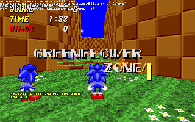

# SRB2 Legacy Web

[SRB2 Legacy](https://github.com/srb2-preservation/srb2-legacy) is an updated fork of [Sonic Robo Blast 2](https://srb2.org) 2.1.25.  
The goal of SRB2 Legacy is to include essential fixes and QOL improvements seen in 2.2.

This repo is a port of SRB2 Legacy to modern web browsers, adding full support for online multiplayer (thanks to WebRTC and the [SRB2Web-Relay](https://github.com/gvbvdxxalt2/SRB2Web-relay) server) and an "easy-to-understand" launcher GUI:

Also see (Other ports by me): [SRB2web](https://github.com/gvbvdxxalt2/SRB2web), [SRB2KartWeb](https://github.com/gvbvdxxalt2/SRB2KartWeb) 

## Compiling & Dependencies

> [!NOTE]
> This mostly follows the same as [SRB2KartWeb](https://github.com/gvbvdxxalt2/SRB2KartWeb) and [SRB2web](https://github.com/gvbvdxxalt2/SRB2web) repos.

> [!NOTE]
> Like I've said on other ports: most of these weren't possible entirely by myself (especially the networking support) thanks to the research and help from [Google Gemini](https://gemini.google.com). _This DOES NOT mean I did absolutley nothing myself._

You'll need Node.JS installed, an Node.JS package manager of your choice (This guide follows NPM, but you can use yarn too) and also some version of linux, preferably you can use [Github Codespaces](https://github.com/codespaces), [Codesandbox](https://codesandbox.io), or (Tested on SRB2web) WSL if you're using Windows. Any typical linux installation should be fine.

Linux tools (Command): `sudo apt install git cmake build-essential python3 unzip curl`

Emscripten compiling (skippable if you already have build-wasm/bin files pre-built):

1. `./get-assets.sh` (`chmod +x get-assets.sh` if it says permission denied) This downloads assets for the port, which will source from the windows release, it should automatically clean up the dll and exe files left over.

2. `./setup-build.sh` (`chmod +x setup-build.sh` if it says permission denied)
This should install and build everything automatically for the emscripten side, the launcher (javascript GUI and WebRTC networking logic) will be done next.

3. Once you run `./setup-build.sh`, every time after that you can just use `./build-wasm.sh` to build it without checking everything, though it should know what isn't needed and what is.

Launcher, networking, and playable site logic:

1. `npm install` Install dependencies for the launcher.

2. `npm run build` (Outputs to launcher-dist) Builds everything, this will automatically also copy over the emscripten build and game resource folders. (You can't use the site on file:// URLs due to how browsers limit resources from being fetched there)

3. (Optional) `npm run start` This starts up a development server that automatically updates as you change the launcher files or rebuild the emscripten logic. You can also set an enviroment variable `PORT` to the port number if you need a specific HTTP port.

## Interact (original, not mine)
- Join the [srb2-preservation Matrix space](https://matrix.to/#/#srb2-preservation:merrycorps.xyz)
- Join the [srb2-preservation Discord server (Git updates only) ](https://discord.gg/2bakGxA5DY)

## Disclaimer
Sonic Team Junior is in no way affiliated with SEGA or Sonic Team. We do not claim ownership of any of SEGA's intellectual property used in SRB2.
